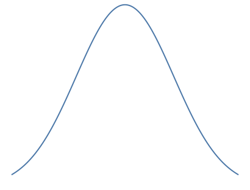
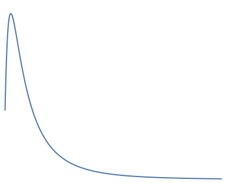
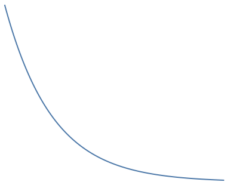
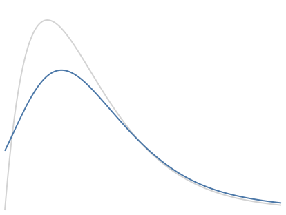
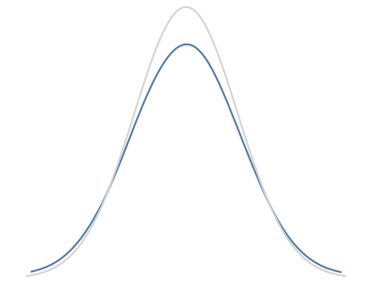
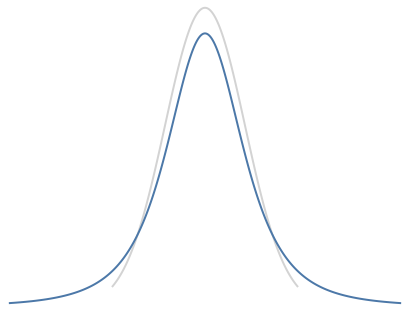

# Distributions used in the simulator
Distributions can generally be characterized as
symetric or asymetric, as well as heavy-tailed or light-tailed []. The distributions below were
chosen becasue they cover each of these broad categorizations and have also been 
previously examined in research on robustness []. For most distributions shapes below, 
the simulator allows users to interactively adjust a parameter that
casues changes in the tail(s) of the distribution.

## Normal distribution

## Lognormal distribution

## Exponential distribution

## Contaminated Chi-squared distribution

## Contaminated normal distribution

(see Wilcox 2003 - Modern robust...)

## Student's T

