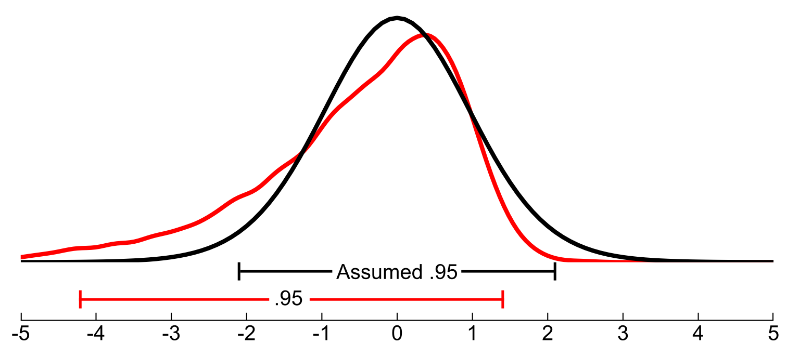

# Robust Statistics Simulator

Robust Statistics Simulator is ...

For more information on robust methods please see Wilcox's book 
[Introduction to Robust Estimation and Hypothesis Testing](https://play.google.com/store/books/details?id=8f8nBb4__EYC&gl=ca&hl=en-CA&source=productsearch&utm_source=HA_Desktop_US&utm_medium=SEM&utm_campaign=PLA&pcampaignid=MKTAD0930BO1&gclid=CjwKCAiA44LzBRB-EiwA-jJipJzyqx9kwNMq5MMU7fG2RrwBK9F7sirX4pfhS8wO7k9Uz_Sqf2P28BoCYzcQAvD_BwE&gclsrc=aw.ds).

## Getting Started

- [Tutorial](tutorial.md)
- [Installation](install_dep.md)

## User Guide
- [Distributions](distributions.md)
- [Estimators](distributions.md)
- [Function reference](function_guide.md)
- [Frequently asked questions](FAQ.md)

## Bug reports and Questions
Robust Statistics Simulator is BSD-licenced and the source code is available
on [GitHub](https://github.com/Alcampopiano/robust_statistics_simulator).
For issues and questions, 
please use [GitHub Issues](https://github.com/Alcampopiano/robust_statistics_simulator/issues).

## Contributing to Robust Statistics Simulator

The best way to contribute to Robust Statistics Simulator is ... 
For more details, please see 
[CONTRIBUTING.md](https://github.com/Alcampopiano/robust_statistics_simulator/blob/master/CONTRIBUTING.md)
in the GitHub repository.